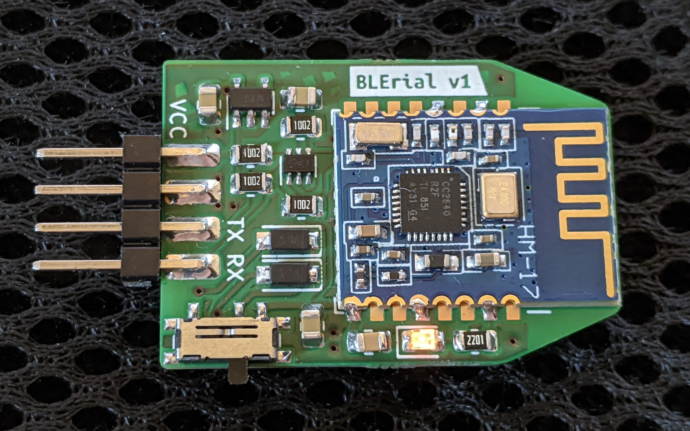
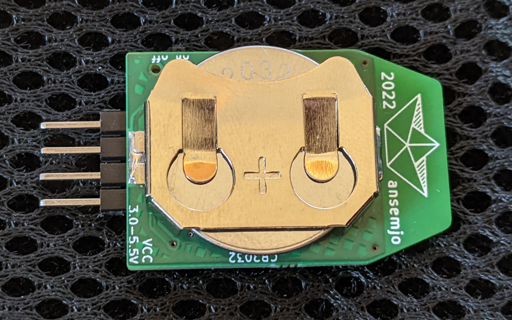
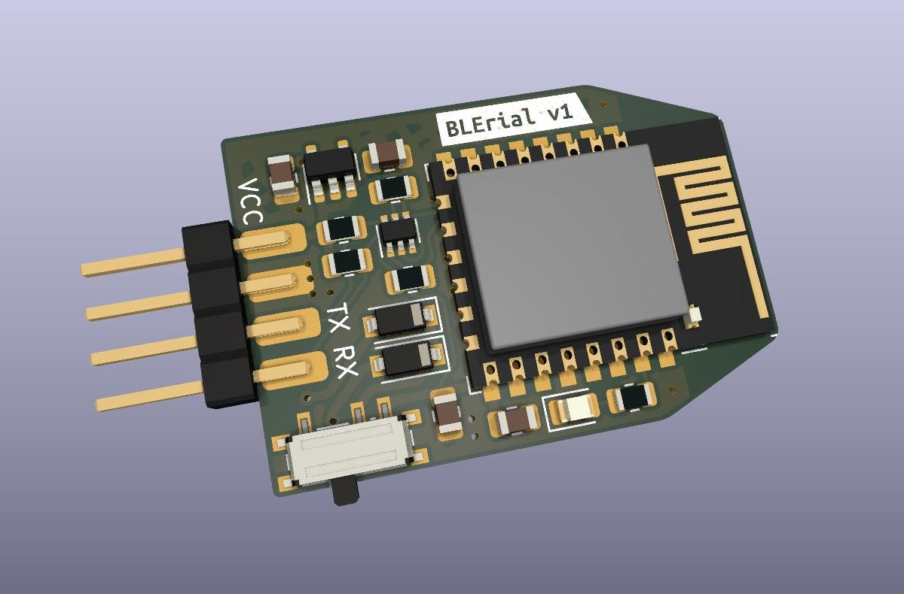

# BLErial v1

Carrier board for a transparent Bluetooth 5.0 BLE to UART bridge based on [JiNan Huamao HM-17 modules](http://www.jnhuamao.cn/bluetooth.asp).

There is loads of such modules on Aliexpress and elsewhere. However, what sets this module apart is the CR2032 coin cell battery on the bottom side, which provides enough juice to power the board before it is physically connected to any device – allowing you to connect the serial console already and capture the very first few packets, as soon as they come in. As soon as the target's VCC is connected, the 3.3 V regulator kicks in and a simple, very much *not* ideal diode "OR" picks the higher voltage of the two supplies. A [level shifter based on two N-channel MOSFETs](https://cdn-shop.adafruit.com/datasheets/AN10441.pdf) shifts the signal levels to whatever reference is given on VCC pin. Therefore the VCC connection is always required; maybe think of it more like a Vref.

## Bluetooth Modules

There are different modules which fit the footprint:

| Model | Bluetooth Version        |
| ----- | ------------------------ |
| HM-19 | BLE 5.0                  |
| HM-17 | BLE 5.0/4.2              |
| HM-13 | Dual Mode: 4.0 EDR + BLE |
| HM-11 | BLE 4.0                  |

I have also successfully connected a JDY-31. This required a glued-on plastic shim and some bodge wires but as long as you can connect `GND`, `VCC`, `RX`, `TX` and some sort of status `LED`, you should be good to go.

## Connection

* For the BLE modules, you can use [Jakeler/ble-serial](https://github.com/Jakeler/ble-serial) to create a `/tmp/ttyBLE` device, which you can then use with your favourite serial terminal.
* Dual Mode or older Bluetooth 2.0 RFCOMM devices can be connected with `rfcomm bind ...`.

## Images

