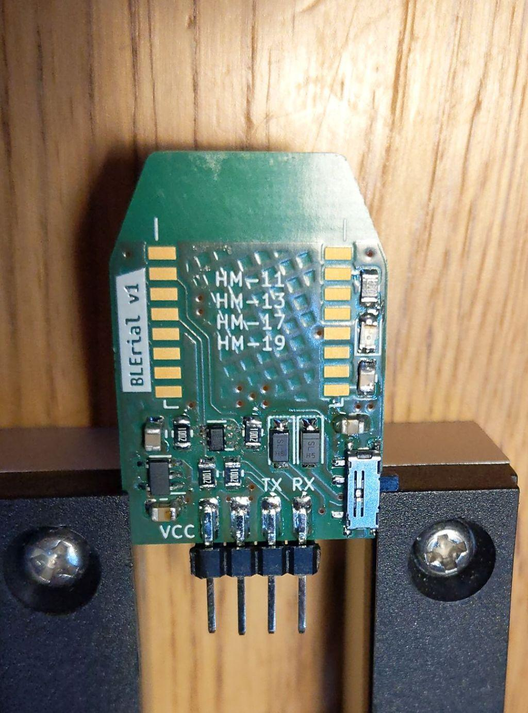

# BLErial v1

Carrier board for a transparent Bluetooth 5.0 BLE to UART bridge based on [JiNan Huamao HM-17 modules](http://www.jnhuamao.cn/bluetooth.asp).

There is loads of such modules on Aliexpress and elsewhere. However, what sets this module apart is the coin cell battery on the bottom side, which provides enough juice to power the board before it is physically connected to any device – allowing you to connect the serial console already and capture the very first few packets, as soon as they come in.

* coin cell holder for CR2032 powers up the board for connection

* a simple diode OR picks between the coin cell or supplied and regulated 3.3V voltage
* [level shifter based on two N-channel MOSFETs](https://cdn-shop.adafruit.com/datasheets/AN10441.pdf) shifts signal level to whatever reference is given on VCC pin

## Ordered PCBs

I am currently missing the HM-17 modules to try it out fully. But a bodge-wired Frankenstein with a JDY-31 module works fine already. :)

